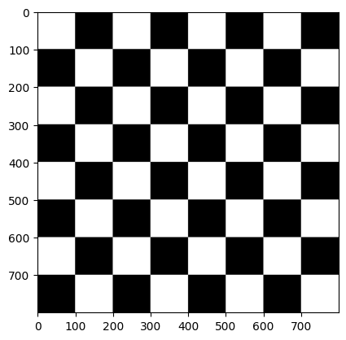
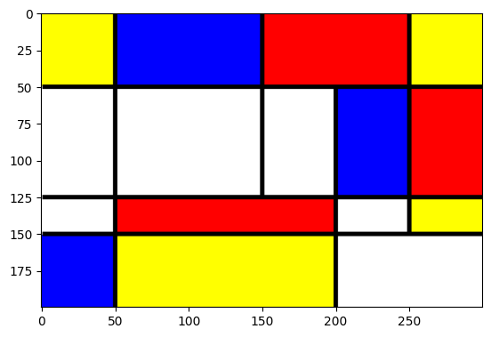
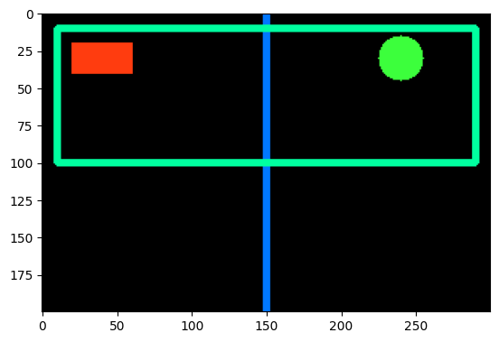
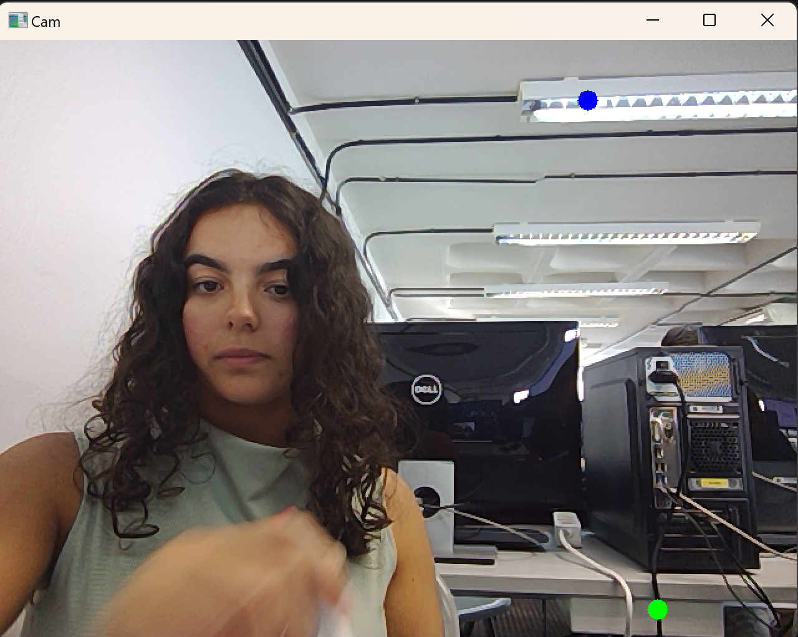
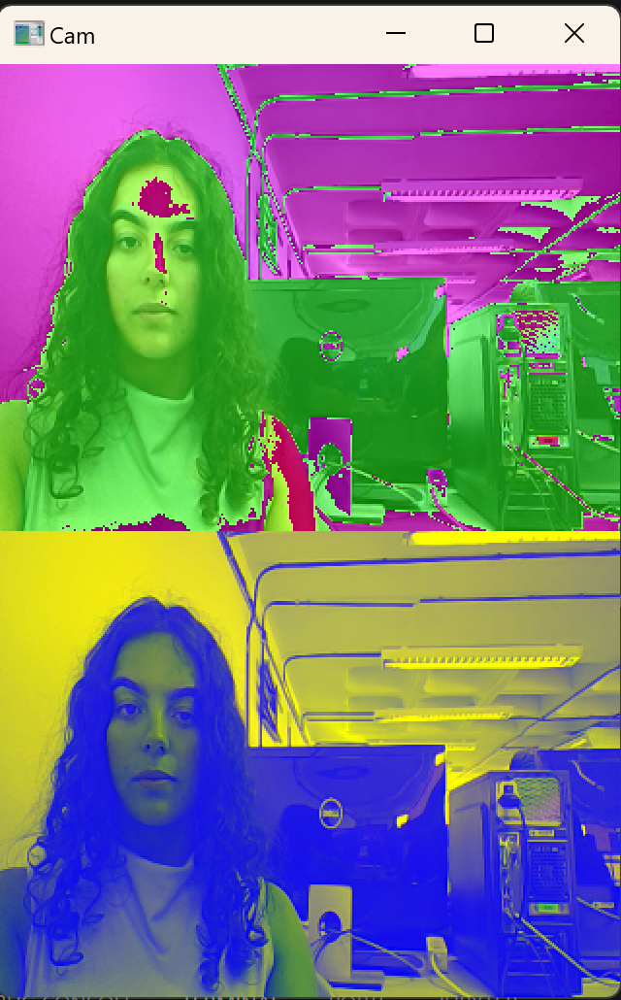

# Práctica 1 - Primeros pasos con OpenCV

In this first assignment we have worked on image processing and for that we have used the OpenCV library in Python. As we have already talked about in person, there have some missunderstandings and so both of us, Ilka and I have submited 2 different answers to these exercises.

## Authors
[Elena's Github](https://github.com/efm092000)

[Ilka's Github](https://github.com/jeski73)

## Tecnologies
  -  Python

## Libraries
  - OpenCV
  - Matplotlib
  - NumPy

## Index

1. [Ajedrez](#ajedrez)
2. [Mondrian](#mondrian)
3. [Modificar un plano de la imagen](#modificar-un-plano-de-la-imagen)
4. [Pintar círculos en posiciones de píxeles claros y oscuros](#pintar-círculos-en-posiciones-de-píxeles-claros-y-oscuros)
5. [Crear un efecto Pop Art personalizado](#crear-un-efecto-pop-art-personalizado)
6. [Conclusión](#conclusión)

## Ajedrez

In this exercise we have to generate the image of a chessboard, for that it is necessary to modify the dimentions of the image, create a single grayscale plane, and iterate over our board, painting the squares black and white.

## Mondrian

We start with a blank image, we position colored squares in certain areas to form the composition. Black lines are also drawn to separate the squares from each other."

## Modificar un plano de la imagen

In this exercise, we utilize the webcam to capture live video. We break down each frame into its red, green, and blue channels and apply a transformation to one of them.

## Pintar círculos en posiciones de píxeles claros y oscuros

For this one, we use the webcam to search for the brightest and darkest 8x8 areas in each frame based on the sum of the color channel values. Circles are drawn in the brightest area and in the darkest area to highlight these regions in the video.

## Crear un efecto Pop Art personalizado

Lastly, we implement a Pop Art effect. The webcam captures the red, green, and blue color channels of each pixel, and we apply different manipulations to separate areas of the image

## Conclusión

With these exercises we've been able to use and better understand the methods of the OpenCV library.

## Bibliografía

1. [W3Schools - Color Picker](https://www.w3schools.com/colors/colors_picker.asp)
2. [GeeksforGeeks - OpenCV cv2.imshow Method](https://www.geeksforgeeks.org/python-opencv-cv2-imshow-method/)
3. [GeeksforGeeks - OpenCV cv2.circle Method](https://www.geeksforgeeks.org/python-opencv-cv2-circle-method/)
4. [OpenCV Documentation - Drawing Functions](https://docs.opencv.org/4.x/da/d6e/tutorial_py_geometric_transformations.html)
5. [OpenCV Documentation - VideoCapture Class](https://docs.opencv.org/4.x/da/d6e/tutorial_py_geometric_transformations.html)