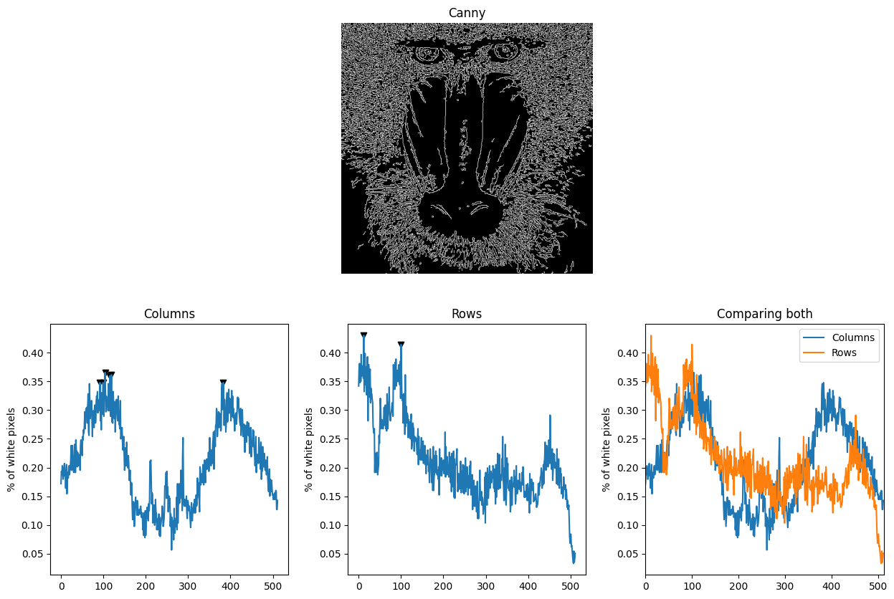
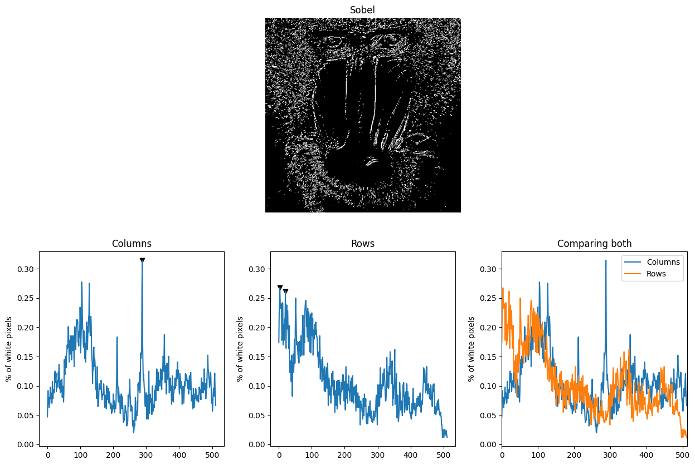
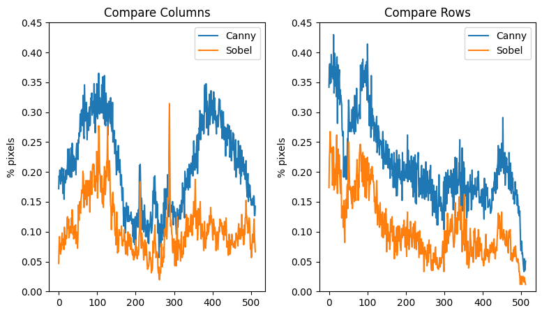
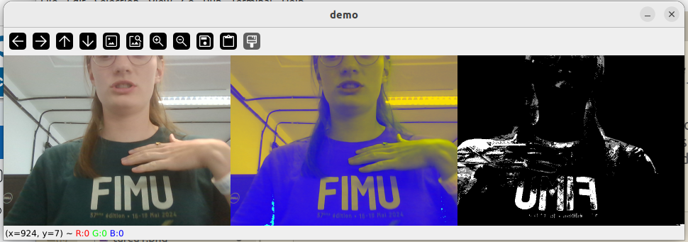
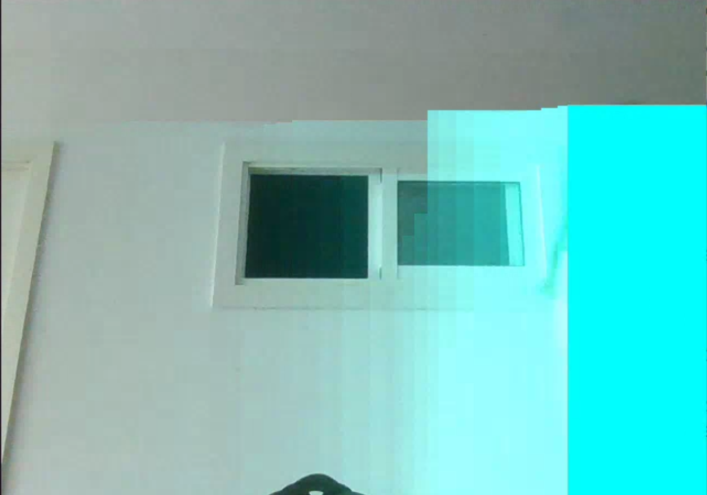

## Práctica 2. Funciones básicas de OpenCV

In the second assignment we have worked on analysing images, we constructed an demonstrater about our learning outcome so far and implemented a new interpretation of image processing.
To achieve all of this we have used the OpenCV library in Python.

## Authors
[Elena's Github](https://github.com/efm092000)

[Ilka's Github](https://github.com/jeski73)

## Tecnologies
  -  Python

## Libraries
  - OpenCV
  - Matplotlib
  - NumPy

## Index

1. [Canny](#canny)
2. [Sobel](#sobel)
3. [3 Frames Demonstrator](#3-frames-demonstrator)
4. [Blue Curtain](#blue-curtain)
5. [Conclusion](#conclusion)
6. [Bibliography](#bibliography)

## Canny

The **Canny edge detection** technique was used to identify the edges of objects within the image. This method works by:

  1. Applying Gaussian filtering to reduce noise.
  2. Finding the intensity gradient of the image.
  3. Applying non-maximum suppression to filter unwanted pixels.
  4. Using double thresholding to detect potential edges.

We gave the charts the same y-axis such that you can compare the outcomes better as they stand right next to each other.

### Analysis

For this part of the task, we calculated the percentage of white (255) pixels per row and column. Additionally, we identified rows and columns that have 95% or more of the maximum white pixels and plotted the results:

  - **Maximum number of white pixels in a row:** 56,100
  - **Rows with ≥ 95% of the maximum white pixels:**
    - 12, 100
  - **Maximum number of white pixels in a column:** 47,685
  - **Columns with ≥ 95% of the maximum white pixels:**
    - 92, 99, 104, 115, 119, 383

## Sobel

The **Sobel operator** calculates the first-order derivative of the image in both the horizontal (x) and vertical (y) directions. The combination of these gradients highlights the edges in the image. After detecting the edges, we applied a threshold to convert the result into a binary image.

Again, we gave the charts the same y-axis such that you can compare the outcomes better as they stand right next to each other.

### Analysis

Just like with **Canny**, we calculated the percentage of white pixels per row and column for the **Sobel** image, highlighting the rows and columns with at least 95% of the maximum number of white pixels.

  - **Maximum number of white pixels in a row:** 34,935
  - **Rows with ≥ 95% of the maximum white pixels:**
    - 3, 20
  - **Maximum number of white pixels in a column:** 41,055
  - **Columns with ≥ 95% of the maximum white pixels:**
    - 288

### Compare Sobel and Canny

The Sobel operator results in a different pixel distribution compared to Canny. Though both methods focus on edge detection, Sobel detects gradients more continuously, while Canny provides sharper, more isolated edges. This can be seen in their comparison. It shows that the umbralization reduces a lot of noise but keeps the important shapes because the percentage of white pixels is lower but the curves stays mostly the same.

## 3 Frames Demonstrator

We created a video demonstrator that shows three different visual effects in real-time using a webcam:

1. **Original Video:** Displays the unaltered video feed.
2. **Color-Shifted Video:** Alters the RGB values to create an Andy Warhol-style artistic effect.
3. **Background Subtraction:** Uses background subtraction to remove static elements from the video, showing only moving objects.

### Results
This visualization effectively combines basic video manipulation techniques and real-time image processing. The output includes color transformations and background removal, allowing the observer to understand the versatility of OpenCV.

## Blue Curtain

Inspired by digital art installations like My Little Piece of Privacy, we developed a real-time effect where moving objects are obscured by a fading blue box as they pass through the camera's view. The moving object's position is detected via background subtraction, and the blue box gradually fades as the object moves, mimicking the concept of selective privacy and motion-tracking art installations.

We used the cv2.findContours method to find boxes around moving objects, ignored small contours and joined the bigger contours to make one big box without whole in between. For the box-fading we created a second image or layer which starts with np.zeros. Each time we calculated the box, it is written onto this layer and the fade out is achieved by multiplying the opaque value of each pixel by 0.9. Then we add this layer to our frame.

## Conclusion

Through this project, we explored the fundamentals of image processing using OpenCV. The comparison of **Canny** and **Sobel** edge detection techniques allowed us to better understand the differences in edge detection methods. Additionally, the **3 Frames Demonstrator** and **Blue Curtain** demonstrate how real-time video processing can be leveraged for artistic expression and privacy simulations.

This project helped solidify our understanding of OpenCV functions, image manipulation, and real-time processing capabilities.

## Bibliografía

1. [W3Schools - Color Picker](https://www.w3schools.com/colors/colors_picker.asp)
2. [GeeksforGeeks - OpenCV cv2.imshow Method](https://www.geeksforgeeks.org/python-opencv-cv2-imshow-method/)
3. [GeeksforGeeks - OpenCV cv2.circle Method](https://www.geeksforgeeks.org/python-opencv-cv2-circle-method/)
4. [OpenCV Documentation - Drawing Functions](https://docs.opencv.org/4.x/da/d6e/tutorial_py_geometric_transformations.html)
5. [OpenCV Documentation - VideoCapture Class](https://docs.opencv.org/4.x/da/d6e/tutorial_py_geometric_transformations.html)
6. [learnopencv - cv2.findContours Method](https://learnopencv.com/contour-detection-using-opencv-python-c/)
7. [OpenCV Documentation - cv2.addWeighted Method](https://docs.opencv.org/3.4/d2/de8/group__core__array.html#gafafb2513349db3bcff51f54ee5592a19)