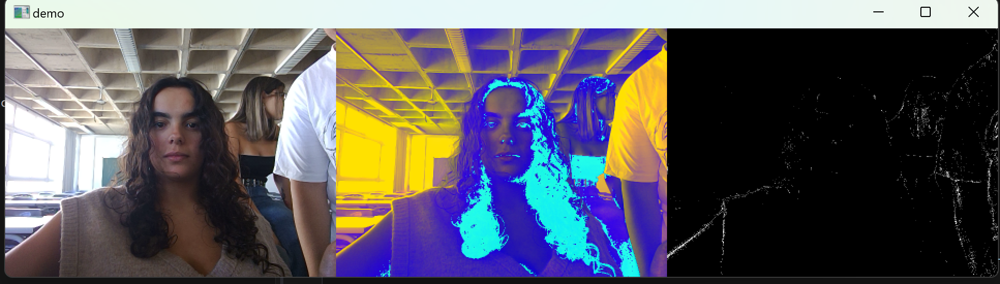

Here's a refined and more detailed version of your README to better present your work and expand on the concepts covered in the project:

---

## **Práctica 2: Funciones Básicas de OpenCV**

In this project, we explored several image processing techniques using the OpenCV library in Python. We implemented edge detection methods such as **Canny** and **Sobel**, compared their results, and developed a demonstrator that showcases these techniques. Additionally, we implemented a reinterpretation of a digital art installation inspired by works like *My Little Piece of Privacy* and *Messa di Voce*, integrating live video processing and visual effects.

### **Authors**
- [Elena's GitHub](https://github.com/efm092000)
- [Ilka's GitHub](https://github.com/jeski73)

### **Technologies**
  - Python

### **Libraries**
  - OpenCV
  - Matplotlib
  - NumPy

---

## **Index**

1. [Canny](#canny)
2. [Sobel](#sobel)
3. [3 Frames Demonstrator](#3-frames-demonstrator)
4. [Blue Curtain](#blue-curtain)
5. [Conclusion](#conclusion)
6. [Bibliography](#bibliografía)

---

## **Canny Edge Detection** 

The **Canny edge detection** technique was used to identify the edges of objects within the image. This method works by:
1. Applying Gaussian filtering to reduce noise.
2. Finding the intensity gradient of the image.
3. Applying non-maximum suppression to filter unwanted pixels.
4. Using double thresholding to detect potential edges.

### **Analysis**

For this part of the task, we calculated the percentage of white (255) pixels per row and column. Additionally, we identified rows and columns that have 95% or more of the maximum white pixels and plotted the results:

- **Maximum number of white pixels in a row:** 56,100
- **Rows with ≥ 95% of the maximum white pixels:**
  - 12, 100
- **Maximum number of white pixels in a column:** 47,685
- **Columns with ≥ 95% of the maximum white pixels:**
  - 92, 99, 104, 115, 119, 383

### **Results**

We visualized the number of white pixels by row and by column, and compared the two metrics. The results demonstrate how **Canny** effectively captures the edges in an image but has differences in pixel distributions compared to **Sobel** (explained next).

---

## **Sobel Edge Detection** 

The **Sobel operator** calculates the first-order derivative of the image in both the horizontal (x) and vertical (y) directions. The combination of these gradients highlights the edges in the image. After detecting the edges, we applied a threshold to convert the result into a binary image.

### **Analysis**

Just like with **Canny**, we calculated the percentage of white pixels per row and column for the **Sobel** image, highlighting the rows and columns with at least 95% of the maximum number of white pixels.

- **Maximum number of white pixels in a row:** 99,960
- **Rows with ≥ 95% of the maximum white pixels:**
  - 449, 450, 451, 452, 453, 454, 457, 458, 464
- **Maximum number of white pixels in a column:** 94,860
- **Columns with ≥ 95% of the maximum white pixels:**
  - 34, 179, 180, 181, 182, 183, 193, 194, 195, 196, 199, 293, 294, 295, and more.

### **Results**

The **Sobel** operator results in a different pixel distribution compared to **Canny**. Though both methods focus on edge detection, **Sobel** detects gradients more continuously, while **Canny** provides sharper, more isolated edges.

---

## **3 Frames Demonstrator** 

We created a video demonstrator that shows three different visual effects in real-time using a webcam:

1. **Original Video:** Displays the unaltered video feed.
2. **Color-Shifted Video:** Alters the RGB values to create an *Andy Warhol*-style artistic effect.
3. **Background Subtraction:** Uses background subtraction to remove static elements from the video, showing only moving objects.

### **Results**

This visualization effectively combines basic video manipulation techniques and real-time image processing. The output includes color transformations and background removal, allowing the observer to understand the versatility of OpenCV.

---

## **Blue Curtain (Inspired by "My Little Piece of Privacy")** 

Inspired by digital art installations like *My Little Piece of Privacy*, we developed a real-time effect where moving objects are obscured by a fading blue box as they pass through the camera's view. The moving object's position is detected via background subtraction, and the blue box gradually fades as the object moves, mimicking the concept of selective privacy and motion-tracking art installations.

---

## **Conclusion** 

Through this project, we explored the fundamentals of image processing using OpenCV. The comparison of **Canny** and **Sobel** edge detection techniques allowed us to better understand the differences in edge detection methods. Additionally, the **3 Frames Demonstrator** and **Blue Curtain** demonstrate how real-time video processing can be leveraged for artistic expression and privacy simulations.

This project helped solidify our understanding of OpenCV functions, image manipulation, and real-time processing capabilities.

---

## **Bibliography** 

1. [W3Schools - Color Picker](https://www.w3schools.com/colors/colors_picker.asp)
2. [GeeksforGeeks - OpenCV cv2.imshow Method](https://www.geeksforgeeks.org/python-opencv-cv2-imshow-method/)
3. [GeeksforGeeks - OpenCV cv2.circle Method](https://www.geeksforgeeks.org/python-opencv-cv2-circle-method/)
4. [OpenCV Documentation - Drawing Functions](https://docs.opencv.org/4.x/da/d6e/tutorial_py_geometric_transformations.html)
5. [OpenCV Documentation - VideoCapture Class](https://docs.opencv.org/4.x/da/d6e/tutorial_py_geometric_transformations.html)
6. [LearnOpenCV - cv2.findContours Method](https://learnopencv.com/contour-detection-using-opencv-python-c/)
7. [OpenCV Documentation - cv2.addWeighted Method](https://docs.opencv.org/3.4/d2/de8/group__core__array.html#gafafb2513349db3bcff51f54ee5592a19)

---