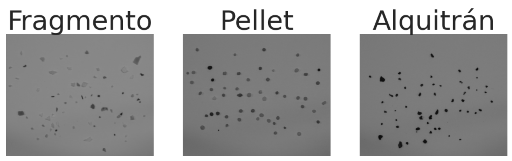
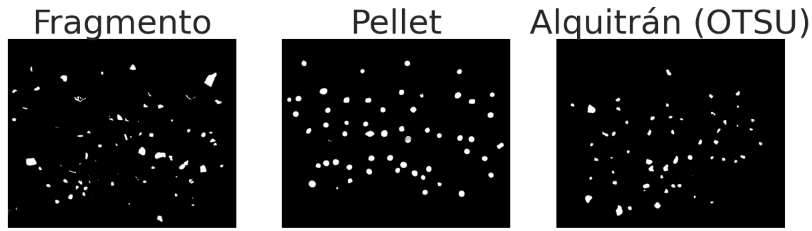
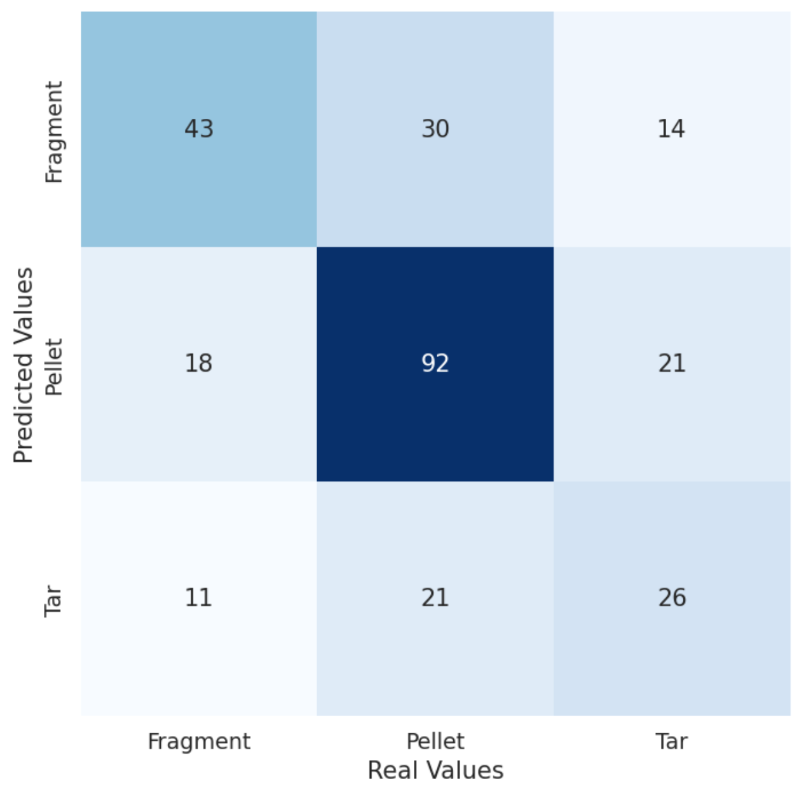

## Práctica 3. Detección y reconocimiento de formas

The objective of this practice is to develop a computer vision system that can detect and recognize objects in an image by extracting their geometric features. This will allow for the automatic classification of these objects into categories. The provided notebook, VC_P3.ipynb, contains examples demonstrating object detection in images, as a first step toward their geometric characterization. Techniques like thresholding and contour detection are used for this purpose.

### Authors
- [Elena's GitHub](https://github.com/efm092000)
- [Ilka's GitHub](https://github.com/jeski73)

### Technologies
  - Python

### Libraries
  - OpenCV
  - Matplotlib
  - NumPy
  - Seaborn
  - sklearn

## Index

1. [Task 1](#task-1)  
2. [Task 2](#task-2)
3. [Conclusion](#conclusion)
4. [Bibliography](#bibliography)

## TASK 1

This task is aimed at developing a computer vision system that identifies coins in an image, computes their values, and outputs the total monetary value present in the image. The coins are identified based on their size and color and the system interacts with the user to pinpoint coins of a specific value (e.g., 1€) by clicking on the image.

### Process
1. **Image Capture and Preprocessing**: Load the image of the coins, convert it to grayscale, and apply thresholding to isolate the coins by detecting their contours against the background.

2. **Coin Class Definition**: Define a Coin class to store the properties of each detected coin, including its size, color, value, position, and contour.

3. **Size and Color Mapping**: Map the standard diameters of different coin types to millimeters and create a size_relation matrix to relate pixel measurements to actual coin sizes.

4. **Contour Detection**: Detect the external contours of the coins in the thresholded image. For each contour, compute the enclosing circle's diameter, position, and average color.

5. **Coin Classificatio**n: Filter potential coin types based on size and color. Coins are classified as either gold or bronze based on their average color.

6. **Size Matching Between Coins**: Use the size ratio matrix to compare the size of coins, refining the classification of coins by matching them to the most likely types.

7. **Monetary Calculation**: Once each coin is classified, calculate the total value of all coins by summing up their individual values and display the result.

### Problems Encountered
- **Non-Coin Objects**: Although size and color filtering works well in many cases, the system may still misclassify non-coin objects of similar color and size as coins. To fix this it is needed to use more enhanced tools recognize other object properties like texture or using a pre-trained model.

- **Color Classification**: We currently distinguish bronze and gold coins based on their average red value. However, this approach is unreliable because some gold coins also have high red values, making it difficult to differentiate between them. Unfortunately, other color channels like green or blue don't provide enough contrast for more accurate distinction, leading to misclassification in certain cases.

## TASK 2
The objective of the code is to preprocess the images to avoid problems derived from shadows in the images, convert them to grayscale and smooth them, in order to prepare the images for further analysis.

The coordinates of the sections to be kept in each image are defined, eliminating problematic areas such as shadows. Cropping is based on these row and column boundaries.

The images in shades of gray are then converted into binary (black and white) images, where pixels below a threshold value are set to one color (0 or 255) and pixels above the threshold to another.

- For the fragment image, an inverted thresholding is applied, with a threshold value of 115, which means that pixels with a value greater than 115 are set to black (0) and pixels less than or equal to 115 become white

- For the pellet image, the threshold is 100 also with an inverted thresholding.

- For the tar image, the Otsu thresholding method is used which automatically calculates the optimal threshold based on the histogram of the image, dynamically adjusting the threshold value to obtain the best separation between the objects of interest and the background, and also with inverted thresholding

Finally, contour detection and classification is performed on thresholded images of fragments, pellets and tar. Then, it creates a confusion matrix that is visualized as a heat map to evaluate the classification performance. The classification criteria are based on geometric features such as compactness, aspect ratio, and elliptical fit of contours.

## Conclusion

In this practice, we developed a system capable of detecting and classifying coins based on their geometric properties, such as size and color, using computer vision techniques. We successfully applied contour detection and thresholding to isolate coins in an image and used size and color mapping to identify them.

The process of distinguishing between different types of coins, especially when considering non-coin objects, highlighted some challenges. One significant issue encountered was differentiating between gold and bronze coins due to color similarities. This indicates the need for more advanced color or texture-based features to improve classification accuracy.

Through this exercise, we gained valuable insights into the complexities of object recognition and the limitations of using basic geometric and color features. 
It serves as a strong foundation for more advanced tasks in object detection and classification, providing a hands-on understanding of key computer vision concepts.

## Bibliography

1. [W3Schools - Color Picker](https://www.w3schools.com/colors/colors_picker.asp)

2. [LearnOpenCV - cv2.findContours Method](https://learnopencv.com/contour-detection-using-opencv-python-c/)

3. [OpenCV Documentation - Contour Features](https://docs.opencv.org/3.4/dd/d49/tutorial_py_contour_features.html)

4. [LearnOpenCV - Object Detection using Contours](https://learnopencv.com/contour-detection-using-opencv-python-c/)

5. [Scikit-learn Documentation - Confusion Matrix](https://scikit-learn.org/stable/modules/generated/sklearn.metrics.confusion_matrix.html)

6. [OpenCV Documentation - Thresholding Techniques](https://docs.opencv.org/3.4/d7/d4d/tutorial_py_thresholding.html)